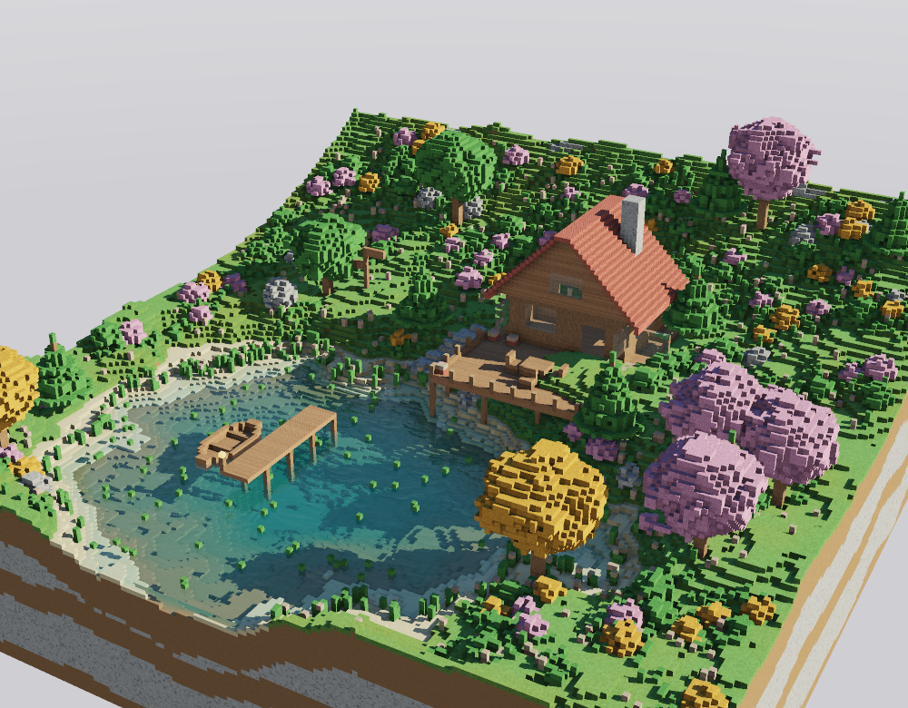
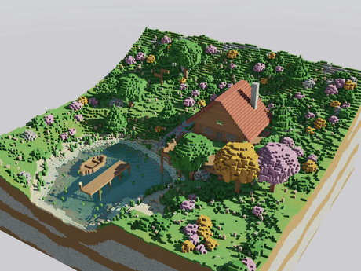
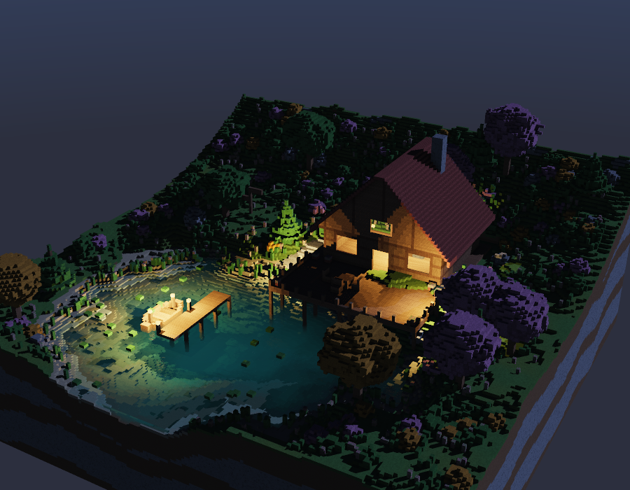
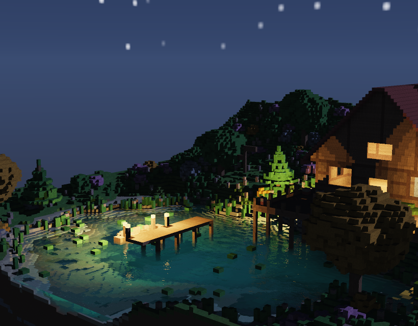
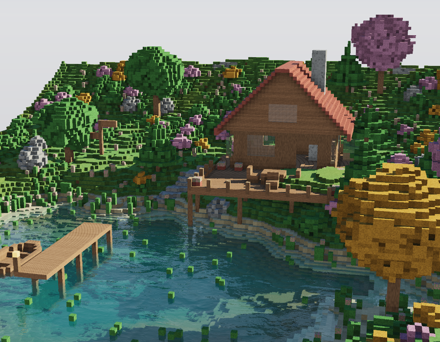
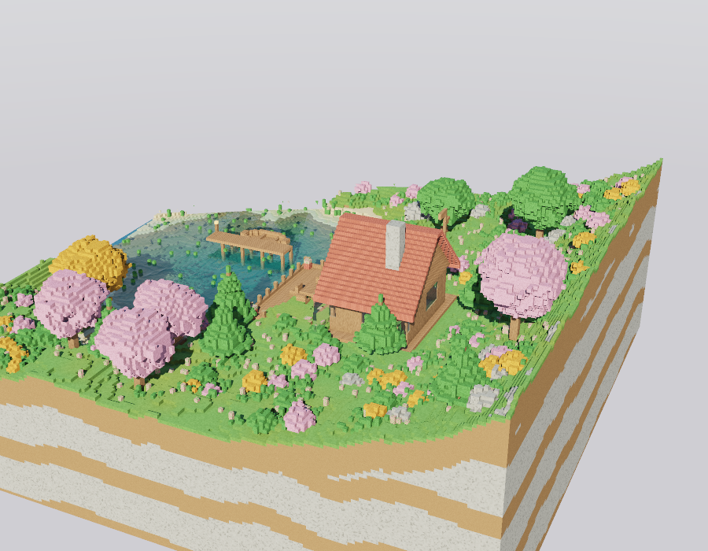
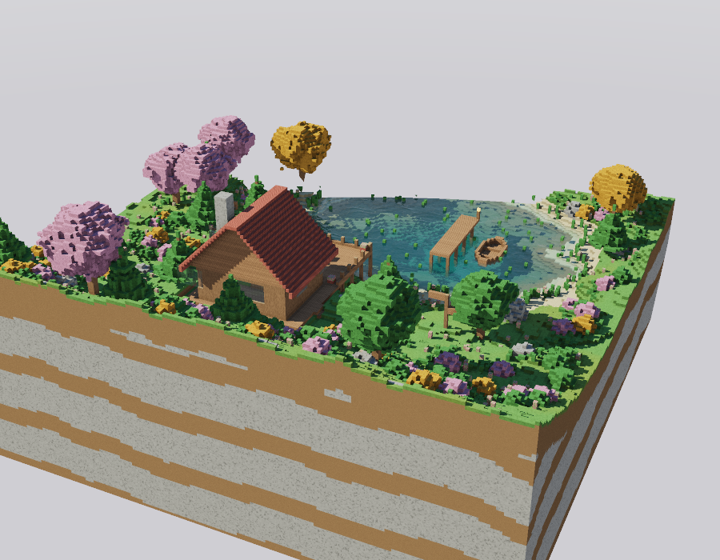

# Diorama Voxel — Raytracer en Rust

Diorama de una laguna con una cabaña de madera, renderizado con un **raytracer escrito desde cero en Rust**, usando **únicamente la librería estándar** (sin crates externos). La escena está construida con cubos texturizados dentro de una rejilla de voxeles de 176×112×176 (≈3.5 millones de celdas) que se recorre con el algoritmo **DDA**.



## Video

Vuelta completa de la cámara con acercamiento y alejamiento, y el oleaje en movimiento:



El video en calidad completa (960×720, 24 fps) está en [`docs/diorama.mp4`](docs/diorama.mp4).

## Modo noche

```bash
cargo run --release -- --night --sun-elev 28 --sun-azim 140
cargo run --release -- --night --window        # interactivo
```





De noche el sol se cambia por una luna tenue y azulada, el skybox se regenera con estrellas y halo lunar, y la escena pasa a iluminarse con los **faroles**: cada bloque emisivo de la escena se convierte en una luz puntual con su atenuación y su propia sombra.

Que eso no cueste caro es por el mismo truco que la oclusión ambiental: como ni los faroles ni la geometría se mueven, **la luz que recibe cada cara de cubo es siempre la misma**, así que se calcula la primera vez que se ve esa cara y se reutiliza. Por eso una imagen de noche cuesta prácticamente lo mismo que una de día, aunque haya nueve luces con sombras.

## Galería

| Laguna: refracción, reflejo y oleaje | Vista lateral |
|---|---|
|  |  |

| Vista trasera: estratos de roca del zócalo |
|---|
|  |

## Modo en vivo (interactivo)

```bash
cargo run --release -- --live
```

Abre la escena dentro de la terminal y la cámara se mueve con el teclado, redibujando en cada cuadro (~20-25 fps):

| Tecla | Acción |
|---|---|
| Flechas o `W` `A` `S` `D` | Girar la cámara alrededor del diorama |
| `+` / `-` (o `z` / `x`) | Acercar y alejar |
| Espacio | Pausar o reanudar el oleaje |
| `r` | Volver a la vista inicial |
| `q` | Salir |

No usa ninguna ventana ni librería gráfica: [`src/live.rs`](src/live.rs) pinta cada celda de la terminal con el carácter de medio bloque `▀` y color RGB de 24 bits, así cada celda muestra dos pixeles. El modo crudo del teclado se pide al programa `stty` del sistema.

## Cómo ejecutarlo

```bash
cargo run --release                          # imagen única -> render.bmp
cargo run --release -- --yaw 120 --distance 220 --samples 2 --out vista.bmp
cargo run --release -- --frames 144 --out frames    # secuencia para el video
```

Para armar el video a partir de los frames (ffmpeg es una herramienta externa, no una librería del programa):

```bash
ffmpeg -framerate 24 -i frames/frame_%04d.bmp -c:v libx264 -pix_fmt yuv420p -crf 20 docs/diorama.mp4
```

### Opciones

| Opción | Qué hace | Default |
|---|---|---|
| `--width`, `--height` | Tamaño de la imagen | 900×700 |
| `--yaw`, `--pitch` | Rotación de la cámara en grados | 30, 27 |
| `--distance` | Distancia de la cámara (zoom) | 270 |
| `--cx --cy --cz` | Punto al que mira la cámara | 0,0,0 |
| `--samples` | Muestras por pixel por eje (2 = 4× antialiasing) | 1 |
| `--sun-elev`, `--sun-azim` | Posición del sol en grados | 33, 110 |
| `--time` | Instante del oleaje | 0 |
| `--frames` | Renderiza N frames de una órbita completa | 0 |
| `--out` | Archivo de salida (o carpeta si hay `--frames`) | render.bmp |

## Cómo se cumple la rúbrica

### Rotación y zoom de la cámara (20 pts)

[`src/camera.rs`](src/camera.rs) implementa una cámara orbital: `orbit()` gira alrededor del diorama (con el cabeceo limitado para que no se voltee) y `zoom()` acerca y aleja. Se controla con `--yaw`, `--pitch` y `--distance`, y el modo `--frames` recorre los 360° variando también la distancia y el cabeceo.

### Materiales (5 pts c/u, máximo 25)

15 tipos de bloque, cada uno con **su propia textura procedural** y sus propios parámetros ([`src/material.rs`](src/material.rs), [`src/texture.rs`](src/texture.rs)):

| Material | Albedo (dif/esp) | Specular | Reflectividad | Transparencia | Índice refracción |
|---|---|---|---|---|---|
| Pasto | 0.95 / 0.05 | 8 | — | — | — |
| Tierra | 0.95 / 0.03 | 6 | — | — | — |
| Piedra | 0.85 / 0.25 | 40 | 0.08 | — | — |
| Arena | 0.95 / 0.10 | 12 | — | — | — |
| Tablón | 0.90 / 0.18 | 24 | 0.03 | — | — |
| Tronco | 0.92 / 0.10 | 14 | — | — | — |
| Hojas (verde, rosa, naranja) | 0.95 / 0.08 | 10 | — | — | — |
| **Agua** | 0.25 / 0.90 | 220 | 1.00 | 0.92 | 1.333 |
| **Vidrio** | 0.15 / 0.80 | 160 | 0.55 | 0.88 | 1.52 |
| Farol (emisivo) | 0.60 / 0.40 | 60 | — | 0.25 | — |
| Teja | 0.90 / 0.15 | 20 | 0.04 | — | — |
| Flor | 0.95 / 0.10 | 10 | — | — | — |
| Viga | 0.88 / 0.14 | 28 | 0.03 | — | — |

Las texturas no son imágenes cargadas de disco: se generan con hash y ruido de valor, dividiendo cada cara del cubo en 16×16 texels. Por eso cada material tiene su propio patrón: vetas y juntas en los tablones, anillos en las tapas del tronco, tejas escalonadas en el techo, marco en el vidrio, grietas en la piedra.

### Refracción (10 pts)

[`src/render.rs`](src/render.rs) aplica la **ley de Snell** en `refract()`, con reflexión total interna cuando corresponde. Tiene sentido en la escena porque el agua de la laguna deja ver el fondo desplazado, y las ventanas de la cabaña son de vidrio. Además el agua aplica **absorción de Beer-Lambert**: el rojo se apaga antes que el azul, así que lo poco profundo se ve claro y el centro de la laguna se pone azul-verde oscuro.

### Reflexión (5 pts)

También en `cast_ray()`: los rayos reflejados usan **Fresnel (aproximación de Schlick)**, de modo que el agua refleja el cielo y los árboles en ángulos rasantes y deja ver el fondo cuando se mira de frente. El vidrio, la piedra, la teja y los tablones tienen reflectividad propia.

### Skybox (20 pts)

[`src/sky.rs`](src/sky.rs) genera un cubo de seis texturas de 256×256 y lo muestrea por dirección con interpolación bilineal. Cada texel se calcula a partir de su dirección 3D (degradado del cielo, nubes con fbm, disco solar y halo), así que no hay costuras entre las caras. El skybox también sirve como **luz ambiental**: el color del cielo en la dirección de la normal ilumina las zonas en sombra.

### Complejidad y atractivo visual (50 pts)

- Terreno procedural con cresta boscosa de fondo, acantilados, afloramientos de piedra y estratos en el zócalo
- Lago cortado en el borde del diorama, con fondo oscuro, juncos, nenúfares, bote y muelle
- Cabaña de 44×36 bloques con zócalo de ladrillo, muros de tablón, esquinas de tronco, ventanales, puerta, techo a dos aguas con alero, chimenea y ventana de ático
- Terraza sobre pilotes que se proyecta sobre el agua, con barandal, mesa, sillas, macetas y faroles
- Bosque de coníferas y árboles frondosos en tres colores, arbustos, hierba alta, flores, peñascos, camino de piedra, banca y letrero
- **Oclusión ambiental** con 13 rayos por impacto, sombras duras del sol, iluminación Phong y tonemap filmico (ACES)

## Arquitectura

| Archivo | Responsabilidad |
|---|---|
| [`src/main.rs`](src/main.rs) | Argumentos, armado de la escena y modo animación |
| [`src/voxel.rs`](src/voxel.rs) | Rejilla de voxeles y recorrido DDA (Amanatides & Woo) |
| [`src/render.rs`](src/render.rs) | Phong, sombras, oclusión ambiental, reflexión, refracción, tonemap |
| [`src/scene.rs`](src/scene.rs) | Generación del diorama |
| [`src/material.rs`](src/material.rs) | Tipos de bloque y sus parámetros |
| [`src/texture.rs`](src/texture.rs) | Texturas procedurales por cara |
| [`src/sky.rs`](src/sky.rs) | Skybox procedural |
| [`src/noise.rs`](src/noise.rs) | Hash, ruido de valor, fbm y oleaje |
| [`src/camera.rs`](src/camera.rs) | Cámara orbital |
| [`src/bmp.rs`](src/bmp.rs) | Escritura de BMP de 24 bits |
| [`src/vec3.rs`](src/vec3.rs) | Álgebra de vectores |

El render usa todos los núcleos disponibles con `std::thread::scope`. Las pruebas del recorrido DDA se corren con `cargo test`.

## Optimizaciones

Una imagen de 900×700 con calidad completa pasó de **375 ms a 111 ms** (3.4× más rápido), lo que permite el modo interactivo:

| Optimización | Qué resuelve | Ganancia |
|---|---|---|
| Rejilla gruesa de 8×8×8 ([`src/voxel.rs`](src/voxel.rs)) | Los rayos saltan de golpe los macro-bloques vacíos en vez de recorrer el aire celda por celda | 375 → 260 ms |
| Reparto dinámico de filas ([`src/render.rs`](src/render.rs)) | Cada hilo toma la siguiente fila libre: las filas de cielo son mucho más baratas que las del bosque y con bloques fijos sobraban núcleos ociosos | 260 → 195 ms |
| Caché de oclusión ambiental por cara de cubo | La geometría no cambia, así que la oclusión de una cara siempre da lo mismo: se calcula una vez y se reutiliza en todos los pixeles y cuadros (enteros atómicos, sin bloqueos) | 195 → 111 ms |

El reparto de costos se midió apagando cada parte por separado: la oclusión ambiental se llevaba la mitad del tiempo, las sombras 22 ms y las texturas 7 ms.

## Créditos

El oleaje del agua (`sea_octave`, `water_height` en [`src/noise.rs`](src/noise.rs)) es una adaptación a Rust del shader [Seascape](https://www.shadertoy.com/view/Ms2SD1) de TDM.
